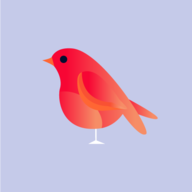
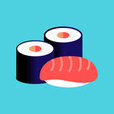

# [ChromiumOS avatar images](https://github.com/chromium/chromium/tree/7797b8c8b6a322bb820452b554279e8c24a6982b/ui/chromeos/resources/default_200_percent/default_user_images/)

## Abstract

| No. | Name | Avatar |
|-----|-----|---------|
| 1 | avocado |  |
| 2 | cappuccino |  |
| 3 | icecream |  |
| 4 | icewater |  |
| 5 | melon |  |
| 6 | onigiri |  |
| 7 | pizza |  |
| 8 | sandwich |  |

## Geo

| No. | Name | Avatar |
|-----|-----|---------|
| 1 | geo1 |  |
| 2 | geo2 |  |
| 3 | geo3 |  |
| 4 | geo4 |  |
| 5 | geo5 |  |

## Illustration
| No. | Name | Avatar |
|-----|------|--------|
| 1 | basketball |  | 
| 2 | bike |  | 
| 3 | bird |  | 
| 4 | chese |  | 
| 5 | football |  | 
| 6 | ramen |  | 
| 7 | sunglasses |  | 
| 8 | sushi |  | 
| 9 | tamagotchi |  | 
| 10 | vinyl |  | 

## Origami

| No. | Name | Avatar |
|-----|-----|---------|
| 1 | butterflies |  |
| 2 | cat |  |
| 3 | corgi |  |
| 4 | dragon |  |
| 5 | elephant |  |
| 6 | fox |  |
| 7 | monkey |  |
| 8 | panda |  |
| 9 | penguin |  |
| 10 | pinkbutterfly |  |
| 11 | rabbit |  |
| 12 | redbutterfly |  |
| 13 | snail |  |
| 14 | unicorn |  |

