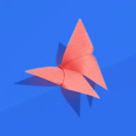
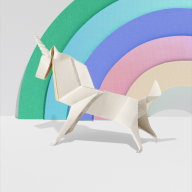

## Origami

| No. | Name | Avatar |
|-----|-----|---------|
| 1 | butterflies |  |
| 2 | cat |  |
| 3 | corgi |  |
| 4 | dragon |  |
| 5 | elephant |  |
| 6 | fox |  |
| 7 | monkey |  |
| 8 | panda |  |
| 9 | penguin |  |
| 10 | pinkbutterfly |  |
| 11 | rabbit |  |
| 12 | redbutterfly |  |
| 13 | snail |  |
| 14 | unicorn |  |

| [Back](../) | [Abstract](../abstract) | [Geo](../geo) | [Illustration](../illustration) |

